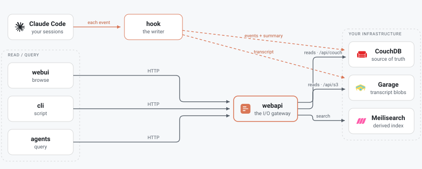

<p align="center">
  
</p>

# Claude Transcripts

[](https://claude.com/claude-code)

**Self-hosted history for your [Claude Code](https://claude.com/claude-code)
sessions.** A Claude Code hook logs every session — events, an end-of-session
summary (counts, tool usage, token usage), and the full transcript — to your own
**CouchDB** + **S3-compatible** storage. A web API serves it back; a web UI and a
CLI (and AI agents) read it.

Everything runs on your own infrastructure. Nothing leaves your network.

<p align="center">
  <picture>
    <source media="(prefers-color-scheme: dark)" srcset="docs/assets/architecture-dark.svg">
    
  </picture>
</p>

> ### ⚠️ Early — a preview, not something to depend on
>
> There are tagged releases with published binaries and container images, and the
> install and upgrade paths have been exercised against a real instance carrying real
> history. What that does **not** mean: it has not been validated on a clean machine
> other than the author's, breaking changes land without notice, and stored data may
> still have to be discarded between revisions.
>
> There is **no auth and no security model** — Tier 1 assumes a single user on a
> single trusted machine, so don't expose it to a network or point it at anything you
> can't afford to lose. Issues and feedback are welcome.

**Status:** early rebuild. Tier 1 (single machine, single user) first — retention,
browse/search, and programmatic access, no auth. The design lives in
[`docs/`](docs/), also published as a
[project site](https://vredchenko.github.io/claude-transcripts/).

## Install

One command. It fetches the release binary for your platform, verifies its checksum,
and hands over to `claude-transcripts install` — which generates this instance's
secrets and ports, starts the backing services, provisions the stores, starts the app,
sets up search, and registers the hook with Claude Code:

```bash
curl -fsSL https://raw.githubusercontent.com/vredchenko/claude-transcripts/main/install.sh | sh
```

Needs **Docker** and **Claude Code**. Not Bun, not a clone. Then:

```bash
claude-transcripts doctor     # write → read → search, end to end
claude-transcripts sessions   # what's been recorded
```

The UI is at `http://127.0.0.1:<WEBAPI_PORT>/app` — `install` prints the address, and
picks a free port block per instance rather than assuming one. Upgrading later is the
same command again; it's idempotent and keeps your history.

Details, including what it writes where: [installation.md](docs/start/installation.md).

## Running from source (contributors)

*The rest of this section is the from-source path — what you want if you're changing
the code. If you just want to record sessions, use the installer above.*

Everything runs on your own machine, bound to `127.0.0.1`, with no auth. The
`7650–7661` range is only a **default**: every port is an `.env` variable
(`WEBAPI_PORT`, `COUCHDB_PORT`, `GARAGE_S3_PORT`, …) and that one file feeds both
Docker Compose and the host-run app, so changing a number moves the port
everywhere at once — pick whatever is free on your box.

**Two ways to provide the backing services** — CouchDB (source of truth),
S3-compatible object storage (transcript blobs), and optionally Meilisearch (a
derived search index):

- **A. All local — the bundled stack.** *Supported; this is the path the steps
  below walk.* The [`deploy/`](deploy/) Docker Compose stack brings up CouchDB +
  Garage (S3) + Meilisearch and their admin UIs from **public** images, and the app
  runs on the host via Bun (or as a container built from this repo). Nothing needs
  to be built or published to try it.
- **B. External backing services.** *Designed for, **not yet verified** — TODO.*
  Only the app runs locally; `.env` points at services you already operate. How far
  it goes today:
  - **S3 — external-capable.** `S3_ENDPOINT` is a full URL, so any S3-compatible
    store works (Garage, MinIO, Cloudflare R2, AWS S3) with `S3_ACCESS_KEY` /
    `S3_SECRET_KEY`. You create the bucket and key yourself — `bun run
    bootstrap:garage` (step 4) only targets the bundled Garage.
  - **Meilisearch — yes, it can be external too.** It's just a URL plus a key
    (`MEILI_HOST` + `MEILI_API_KEY`), so a remote or hosted instance is fine. It's
    also fully optional: `features.meilisearch: false` simply drops the search
    index.
  - **CouchDB — external-capable.** Set `COUCHDB_URL` to the full base URL (plus
    `COUCHDB_USER` / `COUCHDB_PASSWORD`); HTTPS and a path prefix are both
    accepted, e.g. `https://couch.example.com/couchdb`. It wins over
    `COUCHDB_HOST` / `COUCHDB_PORT`, which stay as the bundled-stack shorthand.

  The plumbing is there for all three, but **no external deployment has been
  exercised end to end** — hence the TODO.

  See [backend topology](docs/start/configuration.md#backend-topology--bundled-or-external)
  in the configuration docs.

**Prerequisites:** [Docker](https://docs.docker.com/get-docker/) (with Compose),
[Bun](https://bun.sh) ≥ 1.1, `git`, `openssl`, and
[Claude Code](https://claude.com/claude-code) (to record sessions).

### 1. Clone and install

```bash
git clone git@github.com:vredchenko/claude-transcripts.git
cd claude-transcripts
bun install
```

### 2. Configure secrets

```bash
cp .env.template .env
```

In `.env`: leave `IMAGE_NS` blank (we use public images). `COUCHDB_USER` /
`COUCHDB_PASSWORD` default to `admin`/`admin` — CouchDB 3 refuses to start
without an admin, so the bundled stack ships one; change both if this box isn't
just yours. Generate Garage's internal cluster secrets and paste them in:

```bash
for k in GARAGE_RPC_SECRET GARAGE_ADMIN_TOKEN GARAGE_METRICS_TOKEN; do
  echo "$k=$(openssl rand -hex 32)"
done
```

Leave `S3_ACCESS_KEY` / `S3_SECRET_KEY` empty for now — you fill them in step 4.
App config (DB/bucket names, ports) comes from
[`config/config.template.json`](config/config.template.json) automatically; you
don't need to copy it.

### 3. Start the backing services (public images)

```bash
bun run stack:up:upstream          # CouchDB, Garage, Meilisearch + admin UIs
bun run scripts/stack.ts ps --upstream
```

CouchDB → `:7652` (Fauxton at `/_utils/`), Garage S3 → `:7653` (web UI `:7655`),
Meilisearch → `:7656`. State lives under `deploy/data/` (delete it to reset).

### 4. One-time Garage bootstrap (create the bucket + an app key)

S3 always signs requests, so a bucket and key must exist. One command does it —
it assigns the layout, creates the bucket + app key, grants access, and writes
`S3_ACCESS_KEY` / `S3_SECRET_KEY` into `.env` (idempotent):

```bash
bun run bootstrap:garage
```

<details><summary>Prefer to do it by hand (or the script's admin API doesn't match your Garage)?</summary>

```bash
G="docker exec claude-transcripts-garage /garage"
$G status                                  # note this node's ID
$G layout assign -z dc1 -c 1G <NODE_ID>    # <NODE_ID> from the line above
$G layout apply --version 1
$G bucket create claude-transcripts-sessions
$G key create claude-transcripts-app       # prints a Key ID + Secret — copy both
$G bucket allow --read --write claude-transcripts-sessions --key claude-transcripts-app
```

Then paste the Key ID → `S3_ACCESS_KEY` and the Secret → `S3_SECRET_KEY` in `.env`
(see the [Garage quick-start](https://garagehq.deuxfleurs.fr/documentation/quick-start/)).
</details>

### 5. Run the app

**On the host** (fast iteration — edit + reload, no image build):

```bash
bun run dev:webapi     # http://127.0.0.1:7650  — creates the CouchDB DBs + views on boot
# in a second terminal:
bun run dev:webui      # http://127.0.0.1:7651/app/
```

**Or as a container** (the full stack, app image built locally from this repo):

```bash
bun run stack:up:local   # = stack up --build --upstream: builds + runs the app container
# webapi + webui served at http://127.0.0.1:7650/app/
```

### 6. Smoke-test the write → read path

```bash
bun run cli doctor
```

Expect all checks ✓ — it writes one synthetic session through the webapi and reads
it back (verifying CouchDB + S3 are wired). Then list it: `bun run cli sessions`.

### 7. Record real sessions — install the hook

```bash
bun run cli setup            # verify later with: bun run cli setup --check
```

This writes `~/.config/claude-transcripts/config.json`, ensures the CouchDB
databases, probes the Garage bucket, and registers the logging hook in
`~/.claude/settings.json` for all session events. Now run Claude Code anywhere —
each session is logged; browse them at `http://127.0.0.1:<WEBAPI_PORT>/app` (7650 by
default) — the same address `install` prints.

> From a source checkout the hook runs `bun run <repo>/packages/cli/src/cli.tsx hook
> run`, so keep this clone in place and `bun` on your `PATH`; an installed binary
> registers itself instead and needs neither. Either way it **never blocks a session** —
> if the stack is down, events are dropped rather than surfaced. It writes to CouchDB
> and S3 directly for that reason
> ([ADR 0016](docs/design/decisions/0016-webapi-is-the-io-gateway.md#amendment-the-hook-is-a-second-writer)).

### 8. Backfill existing history

```bash
bun run cli backfill --dry-run     # preview what would be adopted
bun run cli backfill               # adopt on-disk ~/.claude transcripts as history
```

## Configuration

Non-secret deployment-wide settings live in [`config/`](config/) (copy
[`config/config.template.json`](config/config.template.json) → `config/config.json`);
secrets/endpoints in a local `.env` (copy [`.env.template`](.env.template)). The
bundled dev stack runs on ports `7650–7661` with no auth on localhost.

---

## For developers

Everything below is for working **on** Claude Transcripts, not just running it.

### Components

| Component | Path | Role |
|-----------|------|------|
| **hooks** | `hooks/` | Claude Code plugin (writer). Logs sessions; installs per machine. |
| **webapi** | `packages/webapi/` | Bun + Hono gateway: the single I/O surface; serves the SPA in prod. |
| **webui** | `packages/webui/` | React + MUI SPA (optional). |
| **cli** | `packages/cli/` | Bun + Ink user-facing tool + admin utility (optional). |
| **shared** | `packages/shared/` | The app model (central state) + cross-cutting types + token accounting. |
| **scripts** | `scripts/` | Dev-only automation (client gen, image mirroring, release). |
| **deploy** | `deploy/` | Docker Compose: CouchDB + Garage + Meilisearch + admin UIs. |

### Container-based deploy

For a container deploy (rather than running on the host), the combined **app**
image (`claude-transcripts-app`, webapi + prebuilt webui SPA) is published to GHCR
by the `publish-image` GitHub Actions workflow on a `vX.Y.Z` tag
([ADR 0023](docs/design/decisions/0023-lockstep-versioning-and-combined-image.md)). The
default (non-`--upstream`) stack mode pulls mirrored backing images from your own
`${IMAGE_NS}` registry; `--upstream` uses public upstream images instead.

### Docs & conventions

- [`docs/`](docs/) — organised into
  [getting started](docs/start/installation.md),
  [development](docs/develop/getting-started.md),
  [operations](docs/operate/releasing.md), [reference](docs/reference/webapi.md),
  and [design](docs/design/specification.md) (with the
  [ADRs](docs/design/decisions/README.md) nested under it). Published at
  [vredchenko.github.io/claude-transcripts/docs](https://vredchenko.github.io/claude-transcripts/docs/).
- [`CHANGELOG.md`](CHANGELOG.md) — what shipped in each release (lockstep-versioned;
  see [releasing.md](docs/operate/releasing.md)).
- [`CLAUDE.md`](CLAUDE.md) — build conventions and repo invariants for agents.
- **Bun** workspace monorepo, TypeScript (ESM, strict); **Biome** formatting;
  **lefthook** pre-commit. `bun run lint`, `bun run typecheck`, `bun run build`.

## License

[MIT](LICENSE)
</content>
</invoke>
