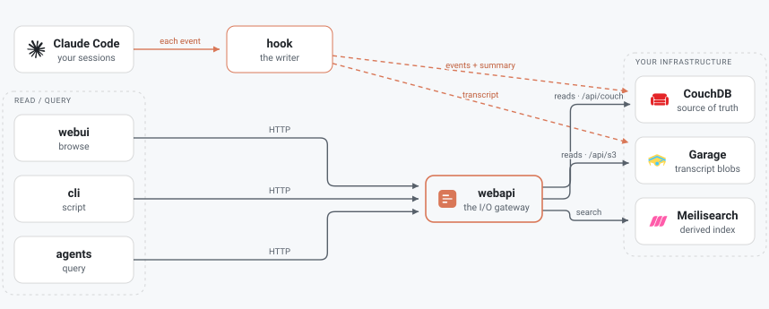

# Architecture

**Every read goes through the webapi** ([ADR 0016](decisions/0016-webapi-is-the-io-gateway.md)):
the webui, CLI, and agents all reach the stores through it, never around it. The one
deliberate exception is **the hook, which writes to CouchDB and S3 directly**
([amendment](decisions/0016-webapi-is-the-io-gateway.md#amendment-the-hook-is-a-second-writer))
— recording a session must not depend on the webapi being up, which is also why the
`_changes` follower exists and why hook-written docs get no write-time validation.
The webapi is **non-optional** — the *stability column* whose contract holds even
as internals change. It transparently proxies, **read-only**, to CouchDB
(`/api/couch`) and S3 (`/api/s3`) where their native API is itself a useful
surface; **writes are never proxied** — they go through curated endpoints that own
the document/blob shapes. See [routes.md](../reference/routes.md) and [tiers.md](tiers.md).

> **Core vs optional:** webapi + CouchDB are core. webui, CLI, Meilisearch, and S3
> are optional/removable — losing one degrades a feature (UI, terminal/agent UX,
> search, blob backups), never the system. Graceful degradation is a first
> principle. Full breakdown in [tiers.md](tiers.md).

## Components

| Path | What it is |
|------|-----------|
| `hooks/` | Claude Code plugin wrapper. `hooks/scripts/dispatch.ts` pipes each hook payload to `claude-transcripts hook run` and always exits 0; it holds no logging code. The writer — events/summaries to CouchDB, transcript blobs to S3, written **directly** so a session is never lost to a webapi outage ([ADR 0016](decisions/0016-webapi-is-the-io-gateway.md#amendment-the-hook-is-a-second-writer)) — is `packages/cli/src/hook/`. |
| `packages/shared/` | The app model + cross-cutting types + `sumTranscriptTokens`. Imported by the webapi and by the CLI's hook — one copy, no duplication. |
| `packages/webapi/` | Hono + Bun read API. Auto-creates the CouchDB DB + design docs on boot. Reads sessions/transcripts; serves the built SPA in prod. |
| `packages/webui/` | React + Vite + MUI SPA. Session list, detail, transcript viewer. |
| `deploy/` | docker-compose stack (CouchDB + Garage + Meilisearch + app). |

## Data model (CouchDB `claude-transcripts-sessions`)

- **event docs** (`type: "event"`) — one per hook event, POSTed live.
- **summary docs** (`_id: "summary:<sessionId>"`, `type: "summary"`) — written at
  `SessionEnd`, carrying counts, `tool_counts`, `token_usage`, and
  `transcript_bytes` (the transcript's size; its content lives in S3 only — never
  in CouchDB, see [ADR 0014](decisions/0014-transcripts-live-in-s3-only.md)).

Design docs (owned by the migrations in `packages/shared/src/migrations/`, applied at webapi boot):

- `sessions/by_date`, `sessions/by_cwd`
- `events/by_session`, `events/by_type`
- `tools/usage`, `tools/failures`, `tools/errors`
- `activity/timeline`
- `chunks/by_session`, `chunks/entry_count_by_session`, `chunks/entries_by_session`
- `session_meta/start_meta` (running-session enrichment), `session_meta/tokens_by_date`
- `session_index/aggregate` (one row per session), `session_index/event_times`
- `speaker_split/by_role`, `speaker_split/by_role_time` (per-turn reads, [ADR 0027](decisions/0027-full-content-chunks-in-couchdb.md))

Blobs live in S3 under `<bucket>/<sessionId>/{summary.json,transcript.jsonl}` —
the transcript's sole durable home. The webapi reads transcripts from S3 only.

## Session status

A session is `ended` once its summary doc lands. Before that it is `running` if it
logged activity within the **live window** — `system.sessions.liveWindowMs`, 24 h by
default — and `incomplete` beyond it (it died without a `SessionEnd`). Separately,
`system.sessions.idleThresholdMs` (5 min) is the gap above which time stops counting
towards a session's *active* duration, which is what distinguishes real working time
from a session left open in a terminal.

## Storage decisions

- **CouchDB** — document store + map/reduce views (event + summary docs only;
  transcript bytes never go in CouchDB).
- **Garage** — vendor-neutral S3 for durable transcript/summary blobs. Accessed
  via Bun's built-in `S3Client`, so MinIO / R2 / AWS work by changing env only.
- **Meilisearch** — full-text search over session metadata *and* conversation
  content, served by `/api/search`. Derived and rebuildable (`claude-transcripts
  reindex`), so losing it costs search and nothing else. It may be bundled or
  external ([ADR 0028](decisions/0028-external-vs-bundled-meilisearch.md)).

> Remaining scope lives in [roadmap.md](roadmap.md); what is in and out of Tier 1
> is set out in [tiers.md](tiers.md).
