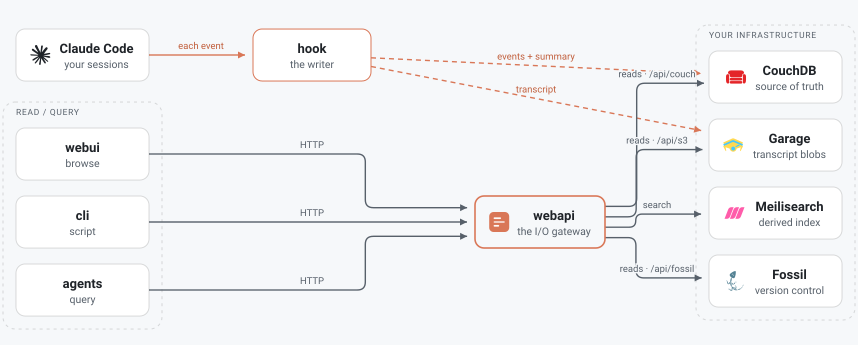

# Architecture

Claude Code keeps transcripts per machine, where they are easy to lose and hard to
search across. Claude Transcripts records every session into stores you run and serves
it back to people and agents. The long-term aim is for Claude Code itself to be the
main reader, recalling and learning from past sessions; that is why the transcript is
kept whole rather than summarised, and why documents are append-only.

Scope is Claude Code only, not agent sessions in general
([ADR 0010](decisions/0010-claude-code-specific-scope.md)).

## Data flow

- **The hook writes.** `claude-transcripts hook run`, registered with Claude Code,
  writes events, chunks and the end-of-session summary to CouchDB and the transcript to
  S3, directly, so recording never depends on the webapi
  ([ADR 0016 amendment](decisions/0016-webapi-is-the-io-gateway.md#amendment-the-hook-is-a-second-writer)).
  It never blocks a session.
- **The webapi is the gateway.** The webui, the CLI and agents read only through it,
  and write only through its curated routes (`/api/ingest/*`, `/api/migrate/*`,
  `/api/search/reindex`). It proxies CouchDB (`/api/couch`) and S3 (`/api/s3`)
  read-only, because their native APIs are useful read surfaces; writes are never
  proxied. Its API is the stable contract while internals change
  ([ADR 0016](decisions/0016-webapi-is-the-io-gateway.md)).
- **Derived state follows CouchDB.** Because the hook bypasses the webapi, the webapi
  follows CouchDB's `_changes` feed to keep the search indexes and its in-memory
  session index current. Hook-written docs get no write-time validation.
- **Provisioning** (`install`, `setup`, `provision`) creates databases and buckets
  directly.

## Components

| Component | Path | Role | Reference |
|-----------|------|------|-----------|
| hook | `packages/cli/src/hook/`, plugin shim in `hooks/` | The writer | [hook.md](../reference/hook.md) |
| webapi | `packages/webapi/` | Gateway; applies migrations on boot; serves the SPA, docs and CLI binary in production | [webapi.md](../reference/webapi.md) |
| webui | `packages/webui/` | Optional React SPA | [webui.md](../reference/webui.md) |
| CLI | `packages/cli/` | Installer, admin tool, terminal client, and the hook | [cli.md](../reference/cli.md) |
| shared | `packages/shared/` | The app model, migrations, cross-cutting types, `sumTranscriptTokens` | [webapi.md](../reference/webapi.md#packagesshared) |
| plugin | `hooks/` | Skills, status command, statusline for Claude Code | [plugin.md](plugin.md) |

**The app model** (`packages/shared/src/model/`) is the central description of the
system: services and ports, stores, hook events, actions and bindings, routes, env
schema, the CLI spec. It is built from `config/` and the environment, served at `/` and
`/api/model`, and projected into Compose files, the k8s base, the plugin's
`hooks.json`, the architecture diagram and the CLI reference.

## Storage

| Store | Holds | If removed |
|-------|-------|-----------|
| **CouchDB** (core) | `event`, `summary` and `chunk` docs; full-content chunks carry the parsed, pruned turns ([couchdb.md](../reference/couchdb.md)) | Not allowed: it is the source of truth |
| **S3**, bundled as [Garage](https://garagehq.deuxfleurs.fr) (`features.s3Blobs`) | `<bucket>/<sessionId>/transcript.jsonl` (byte-exact, its only home, [ADR 0014](decisions/0014-transcripts-live-in-s3-only.md)) and `summary.json` | No byte-exact transcript; CouchDB keeps the pruned turns |
| **Meilisearch** (`features.meilisearch`) | Derived search indexes over session metadata and turns, rebuildable with `reindex` | No search, nothing else changes |

The webapi and CouchDB are the only required parts. The webui, CLI, S3 and Meilisearch
are optional, and losing one loses only its feature. S3 is reached through
`Bun.S3Client`, so Garage, MinIO, R2 or AWS work by changing the environment
([ADR 0003](decisions/0003-vendor-neutral-s3-drop-minio-and-rclone.md)). Why these
technologies: [database-choice.md](database-choice.md).

## Session lifecycle

1. `SessionStart` resets per-session state, writes an event doc, prints the banner and
   injects the recall primer.
2. Each prompt, tool call and stop writes an event doc; the transcript is tailed into
   `chunk` docs every 200 entries or 15 s ([mid-flight-chunking.md](mid-flight-chunking.md)),
   so a live or crashed session can be read.
3. `SessionEnd` flushes the last chunk, writes `summary:<id>` with counts and token
   usage, and uploads the transcript to S3.

Status is derived: `ended` once the summary exists, otherwise `running` within
`system.sessions.liveWindowMs` (24 h) of its last activity and `incomplete` after.
Active duration excludes gaps longer than `system.sessions.idleThresholdMs` (5 min).

## Tiers

Three tiers, each a superset of the one below and none allowed to break it
([ADR 0015](decisions/0015-tiered-architecture.md)):

- **Tier 1 (current)** — one machine, one user. Durable capture, browse and search,
  programmatic access. No auth: the bundled services bind to localhost and need no
  credentials from you, except CouchDB's default admin
  ([ADR 0020](decisions/0020-bundled-services-default-no-auth.md)). Its exit gate, an
  end-to-end suite that fakes Claude Code sessions, is in place
  ([testing.md](../develop/testing.md)).
- **Tier 2** — make history useful to future sessions: recall during live sessions
  (started, [plugin.md](plugin.md)), learning from past sessions, analytics,
  attribution across machines and users.
- **Tier 3** — multiplayer and public release: CouchDB replication between instances
  (which the append-only document model is designed for), auth, hook-drift checks in
  CI.

What is planned within each: [roadmap.md](roadmap.md).

## Stack

Bun + TypeScript (ESM, strict) throughout, in one workspace
([ADR 0004](decisions/0004-bun-monorepo-hook-as-standalone-plugin.md)). webapi: Hono,
`@hono/zod-openapi`, `nano`. webui: React 19, Vite, MUI, TanStack Router and Query. CLI:
Ink. API clients are generated from the OpenAPI spec with orval
([ADR 0019](decisions/0019-openapi-source-of-truth-generated-clients.md)). Biome and
lefthook. Releases on GitHub Actions to GHCR and GitHub Releases
([releasing.md](../operate/releasing.md)).
